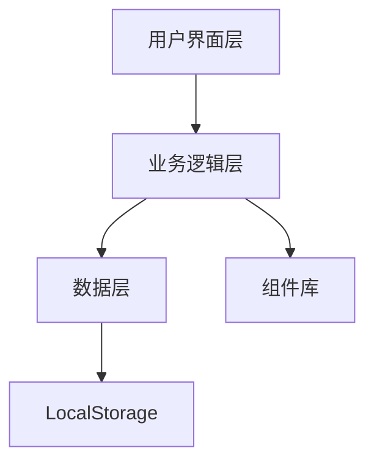
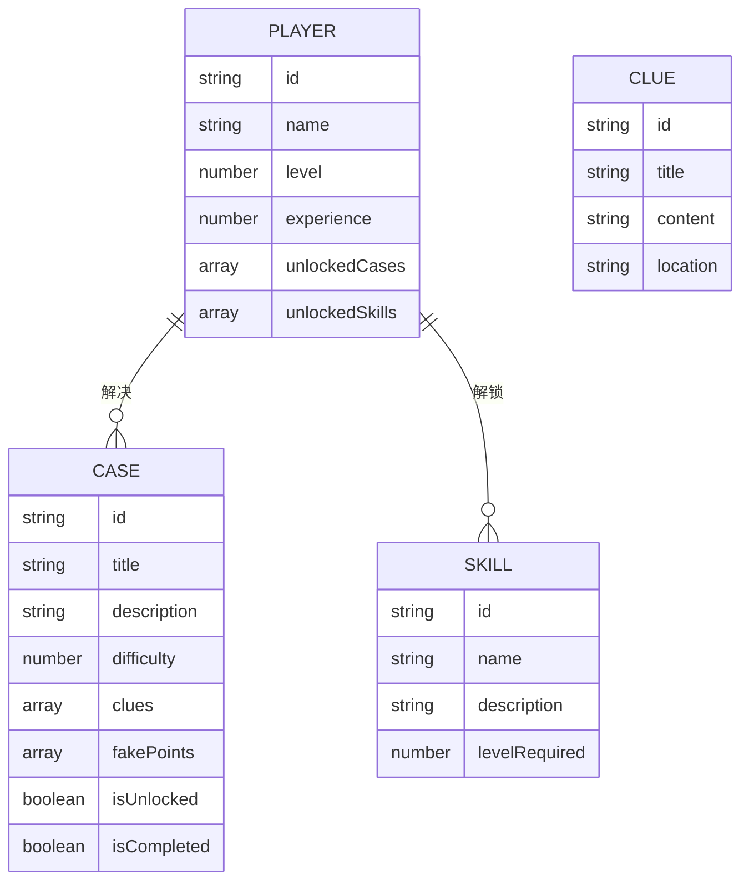

## 1. Architecture Design
游戏采用纯前端架构，使用React + TypeScript构建，状态管理使用Zustand，路由管理使用React Router。游戏数据存储在localStorage中，无需后端服务。



## 2. Technology Description
- Frontend: React@18 + TypeScript@5 + tailwindcss@3 + Vite@5
- Initialization Tool: vite-init
- Backend: None
- Database: LocalStorage

## 3. Route Definitions
| Route | Purpose |
|-------|---------|
| / | 开场页面 |
| /game | 游戏主界面 |
| /case/:id | 案件调查页面 |
| /ending | 结局页面 |

## 4. API Definitions
无后端API，所有数据存储在LocalStorage中。

## 5. Server Architecture Diagram
无后端服务。

## 6. Data Model
### 6.1 Data Model Definition


### 6.2 Data Definition Language
无数据库，使用TypeScript类型定义。

```typescript
interface Player {
  id: string;
  name: string;
  level: number;
  experience: number;
  unlockedCases: string[];
  unlockedSkills: string[];
  currentProgress: {
    caseId: string;
    collectedClues: string[];
  } | null;
}

interface Case {
  id: string;
  title: string;
  description: string;
  difficulty: number;
  story: string;
  scenes: Scene[];
  financialStatements: FinancialStatements;
  fakePoints: FakePoint[];
  clues: Clue[];
  isUnlocked: boolean;
  isCompleted: boolean;
  wClue?: string;
}

interface Scene {
  id: string;
  name: string;
  description: string;
  image: string;
}

interface FinancialStatements {
  balanceSheet: FinancialStatement;
  incomeStatement: FinancialStatement;
  cashFlowStatement: FinancialStatement;
}

interface FinancialStatement {
  title: string;
  items: FinancialItem[];
}

interface FinancialItem {
  id: string;
  name: string;
  value: string;
  notes?: string;
}

interface FakePoint {
  id: string;
  statementType: 'balanceSheet' | 'incomeStatement' | 'cashFlowStatement';
  itemId: string;
  description: string;
  hint: string;
}

interface Clue {
  id: string;
  title: string;
  content: string;
  location: string;
  isHidden?: boolean;
}

interface Skill {
  id: string;
  name: string;
  description: string;
  levelRequired: number;
  icon: string;
}
```
