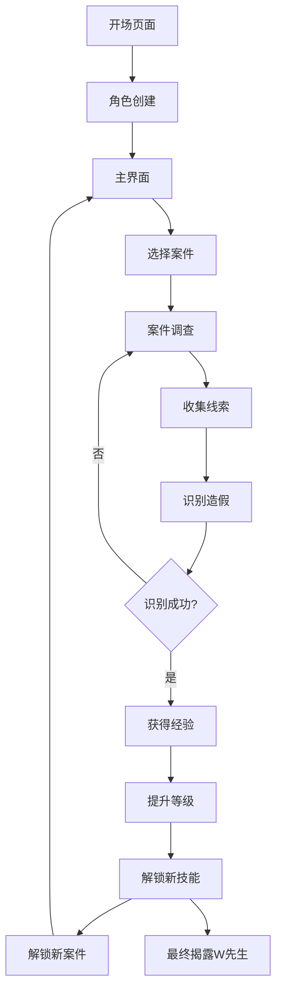

## 1. Product Overview
寻找W先生是一款财务造假识别角色扮演类游戏。玩家从财务小白开始，通过解决一系列财务造假案件的侦探式探索，最终成长为识别财务造假的顶级高手。游戏通过沉浸式的故事情节和互动玩法，让用户在娱乐中学习财务知识。

## 2. Core Features

### 2.1 User Roles
| Role | Registration Method | Core Permissions |
|------|---------------------|------------------|
| 玩家 | 无需注册，游戏内建立角色档案 | 游戏进度保存、案件调查、技能升级 |

### 2.2 Feature Module
1. **开场页面**: 游戏介绍、角色创建、新手引导
2. **主界面**: 案件选择、角色状态、技能树
3. **案件调查页面**: 案件场景、财务数据、线索收集、造假识别
4. **结局页面**: 案件总结、技能提升、W先生线索

### 2.3 Page Details
| Page Name | Module Name | Feature description |
|-----------|-------------|---------------------|
| 开场页面 | 开场动画 | 动态背景、游戏标题动画、旁白介绍 |
| 开场页面 | 角色创建 | 输入玩家姓名、选择头像 |
| 主界面 | 案件列表 | 按时间线排列的案件、已解锁案件高亮 |
| 主界面 | 角色状态 | 当前等级、经验值、已解锁技能 |
| 案件调查页面 | 场景切换 | 不同财务场景（办公室、会议室、档案室 |
| 案件调查页面 | 财务报表 | 资产负债表、利润表、现金流量表、线索标注 |
| 案件调查页面 | 线索收集 | 点击可疑数据点获取线索、线索背包管理 |
| 案件调查页面 | 造假识别 | 提交识别结果、即时反馈 |

## 3. Core Process
玩家进入游戏后，创建角色，然后按照时间线逐步解锁案件。每个案件中，玩家需要在财务报表中找到造假线索，收集证据，最终揭露造假行为。随着案件解决，玩家获得经验值提升等级，解锁新技能，最终揭开W先生的神秘面纱。

## 4. User Interface Design
### 4.1 Design Style
- Primary color: 深紫色 (#6B46C1) + 金色 (#F59E0B)
- Secondary color: 深蓝色 (#1E3A8A) + 灰白色 (#F3F4F6)
- Button style: 圆角矩形，悬停时有发光效果
- Font: 标题使用思源黑体粗体，正文使用思源宋体
- Layout style: 卡片式布局，左右分栏
- Icon style: 线性图标，带有轻微动画效果

### 4.2 Page Design Overview
| Page Name | Module Name | UI Elements |
|-----------|-------------|-------------|
| 开场页面 | 开场动画 | 深色渐变背景、动态粒子效果、标题文字渐入、侦探风格界面 |
| 开场页面 | 角色创建 | 卡片式表单、头像选择器、平滑过渡动画 |
| 主界面 | 案件列表 | 时间线布局、案件卡片悬停效果、状态指示器 |
| 主界面 | 角色状态 | 进度条动画、技能图标、等级徽章 |
| 案件调查页面 | 场景切换 | 3D视角切换、场景过渡动画 |
| 案件调查页面 | 财务报表 | 表格高亮、数据点闪烁、线索标记 |
| 案件调查页面 | 线索背包 | 抽屉式设计、线索卡片、拖拽效果 |

### 4.3 Responsiveness
Desktop-first, mobile-adaptive, touch optimization

### 4.4 3D Scene Guidance
- Environment: 办公室、会议室、档案室等财务相关场景
- Lighting: 暖色调、柔和的阴影效果
- Camera: 固定视角，可平移缩放
- Composition: 焦点在财务数据上
- Interactions: 点击数据点触发线索收集
